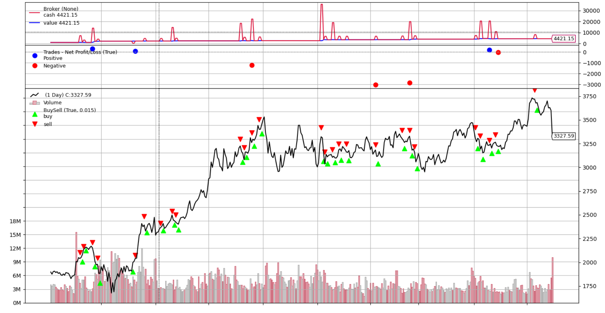

<H1>Testing insider trading strategies using data from SEC Form 4 </H1>

<i>Last updated: Jan 8, 2022 </i> <b>In progress..</b> 

<Header mt={20} variant="section-title"> Executive Summary</Header>

This article aims to answer the question: <b><i>Does the average US executive benefit from trading their own company stock, and if so, under what condition?</i></b>

Insider trading data for 3700 NASDAQ-listed companies was collected via web scraping from <Link href="http://openinsider.com/" isExternal>OpenInsider</Link>. Trading signals (Buy/Sell) were generated from the data where both types of positions were held for 5 days, and trades were simulated via <Link href="https://www.backtrader.com/" isExternal>Backtrader</Link>, based on historical price data obtained from Yahoo Finance, between 01/08/2017 and 01/08/2021. For simplicity, no transaction fees, taxes or dividends were simulated. A priori, we expected results to vary by the market capitalization and the industry the firm operates in.

<b>Profitability:</b> Not profitable as of 2022 Jan 2, however further analysis is needed to decide if it is worth filtering by transaction type and managers.

<H4>Strategy Returns (%) by Market Cap/Industry </H4>
<InsiderResult />

<b>Limitations:</b> Given that executive compensation packages usually consist of stock options in the company, it is fair to assume that much of the "insider trading" is not done due to speculation or insider information. Managers can get short on cash as anyone else. Unfortunately, the intentions of the managers cannot be accounted for. Secondly, one can argue that given how easily accessible the trading information is, in the age of high-frequency trading all these transactions are "priced in" in an ideal market.

<b>Applications:</b> Could contribute as a signal in more complex trading algorithms. Could amplify signal if "insider trading" also took place frequently.

<H4> Best and worst performers by tickers</H4>
<Table variant='striped' colorScheme='gray' mt={5} mb={5}>

<Thead>
<Tr>
<Th>Ticker</Th>
<Th>Profit (%)</Th>
<Th>Ticker</Th>
<Th>Loss (%)</Th>
</Tr>
</Thead>
<Tbody>
<Tr>
<Td>AMZN</Td>
<Td color="green">342.115125</Td>
<Td >GOOGL</Td>
<Td color="red">-111.272107</Td>

</Tr>
<Tr>
<Td>COIN</Td>
<Td color="green">37.283029</Td>
<Td>GOOG</Td>
<Td color="red">-105.466321</Td>

</Tr>
<Tr>
<Td>ILMN</Td>
<Td color="green">30.127989</Td>
<Td>MDB</Td>
<Td color="red">-48.480714</Td>
</Tr>
<Tr>
<Td>NVAX</Td>
<Td color="green">24.648999</Td>
<Td>MRNA</Td>
<Td color="red">-45.071704</Td>
</Tr>
<Tr>
<Td colorScheme="cyan">QDEL</Td>
<Td color="green">20.298000</Td>
<Td>MPWR</Td>
<Td color="red">-28.966997</Td>
</Tr>
</Tbody>
</Table>

<H4>I. Background</H4>

Since 1934 the US Security and Exchange Commission requires all company personnel having ownership of more than 10% of the company equity to file a report within 48 hours of selling/buying company stocks. This data is online and publicly available in the <Link href="https://www.sec.gov/edgar/search-and-access" isExternal>SEC database</Link>.

This article aims to explore the possible strategies that can be built upon acquiring this information.

<Header mt={5} mb={5} variant="section-title">II. Collecting Insider Trading Data </Header>

Fortunately, there are multiple sites available that track insider trading information of big companies. While I couldn't find a free publicly available API, we can do a bit of web scraping with Python Pandas read_html function.
First, we define a few methods, namely:
 
 
<b>fetch_insider_data(ticker):</b> saves the insider trading data in a .csv format for each company ticker, from <Link href="http://openinsider.com" isExternal> OpenInsider</Link>.

 
<b>fetch_sp500():</b> returns a Pandas data frame with a list of SP500 company tickers
 
<b>populate_data():</b> fetches the insider data for all SP500 tickers
 
<b>grid_search():</b> collects Sales and Purchase dates of stocks from the collected data and returns a list of sales and buys with dates. These will be used as trading signals in the testing phase. If unsuccessful, returns two empty lists. 
 
<b>backtest_strat(sell_dates, buy_dates):</b> Just a "checkpoint" to see what data we are working with.
 
<b>get_strategy(): </b>will be passed to the testing phase, where if it is called will initiate the whole process.

<H4>III. Backtesting strategies with Backtrader and Cerebro</H4>

 In the next step, we will use <Link href="https://www.backtrader.com/" isExternal>Backtrader</Link> and Cerebro to see how we perform if we buy/sell stocks accourding to the insider trading information. 
First we get our historic test data from the Yahoo Finance API, which we (optionally) save to a local directory, so we don't have to reload it every time we test a strategy. 
get_ticker_historic(ticker, offline) reads and saves historical price data and returns a pandas dataframe. 
TestStrategy() is a boilerplate class for Backtrader and Cerebro, where the historical data [Adj. Close] is matched with the buy/sell signals, and the trading for a specific time period is simulated. 
Notice that we set commission to zero, as this is a purely theoretical test. 

<H4>IV. Testing with parameters </H4>

Running the algorithm for the first time would yield a whopping negative 100% loss, as short positions are assumed to be held indefinitely. It is obvious that we need to come up with an arbitrary short period to fit all short positions, so why not do a bruteforce gridsearch for it?

 With all the necessary methods set we test the ideal short period for each stock, and draw an average.
After the first optimal parameter (short-period) was found, there are multiple ways to analyze the data. A priori, the top 3 variables I  could think of:
 
<b>1)The market capitalization of the underlying company:</b> Managers of higher market cap companies might not have much asymmetric information due to diseconomies of scale
 
<b>2)The sector the company operates in:</b> It is worth measuring what sector the company operates in, as it can have an effect on managerial behaviour and asymmetric information. 
 
<b>3)Trade turnover:</b> the amount of time a single stock of the company's is traded on a periodic basis
 

For 1) we divide companies to 6 market cap categories: mega, big,mid, small, micro and nano.
For 2) we can categorize tickers by the industry they operate in.
For 3) we will make up a ratio of volume of annual trade divided by shares outstanding.

<H4>IV a): Plotting by market cap. </H4>

 The following code breaks down returns by market cap on a log scale and by sector (just in case):
 

 After separating companies by market cap to mega, big, mid, small , micro and nano, and mapping our trading strategy to each, we can plot profit/loss in percentage by market cap: 

<H4>Plotting market cap (USD) to log return (%) </H4>
< InsiderGraph />

 Based on the graphs, it is hard to establish any correlation. It seems that with the current testing parameters there is no significant difference between market cap categories.

In further exploration we will look into basic analysis to support this with numbers.

<H4>IV a): Plotting by trade_turnover. </H4>

 To measure how actively the company stock is traded, we have to come up with an arbitrary ratio <b>trade_turnover</b> which is the company's shares outstanding divided by the sum of all volumes traded in the 3 year period. The following code compiles a new column for our dataframe with these values.

 Based on the new values we can plot trade turnover against profit/loss from the strategy:

<H4 mb={5}> Plotting log(trade_turnover) to log(profit)</H4>

<H4>V.Conclusion</H4>

The question this project aimed to answer was:  <b><i>Does the average US executive benefit from trading their own company stock, and if so, under what condition?</i></b>

 

Based on the collected data and trading signals, it is unlikely that on this level of analysis any profitable trading strategy can be devised from this information alone.
This suggests, that unlike some social media influencers and trading gurus suggest, if investments are made based on managers trading their company stock, a strong negative results
is expected in most cases.

While Mega Cap tickers yielded a 3.6% return on average over the examined 3 years, accounting for brokerage fees, risk-free discount rate and inflation, in a practical sense they should be considered a loss as well.

Nevertheless, with a combination of more complex weighting of trading signals and other indicators, this information could contribute to a profitable trading strategy.  

<H4>Sources</H4>
<UnorderedList>
<ListItem>OpenInsider: http://openinsider.com/</ListItem>
<ListItem>Images used for collage:</ListItem>
<UnorderedList>
<ListItem>https://techcrunch.com/wp-content/uploads/2019/10/jeff-bezos-iac-2019-1.jpeg?w=1024</ListItem>
<ListItem>https://media-cldnry.s-nbcnews.com/image/upload/newscms/2021_07/3451526/210220-charging-bull-al-1143.jpg</ListItem>

</UnorderedList>

